The integration is referencing [this](https://www.ibm.com/docs/en/cloud-paks/cloud-pak-watson-aiops/4.1.0?topic=integrations-tivoli-netcoolimpact-connections)

# Before you begin

- Ensure that you have IBM Tivoli Netcool/Impact Version 7.1 or later and IBM Cloud Pak for Watson AIOps 4.1.0 installed.

- Obtain the following details for your IBM Tivoli Netcool/Impact deployment:

    - The GUI server URL (example: https://noi-impact.fyre.ibm.com:16311)

    - The Back-end server URL (example https://noi-impact.fyre.ibm.com:9081)

    - The administrator username and password for connecting to the IBM Tivoli Netcool/Impact endpoint.

    - A valid CA certificate for IBM Tivoli Netcool/Impact if the endpoint is secured by SSL/TLS. If self-signed this means all the certificates from all the server.

      You can extract these certificates from your IBM Tivoli Netcool/Impact deployment with openssl:

      For the GUI server (port 16311)
```sh
openssl s_client -showcerts -servername noi-impact.mycluster.com -connect noi-impact.mycluster.com:16311 </dev/null
```

Sample:      

<picture>
  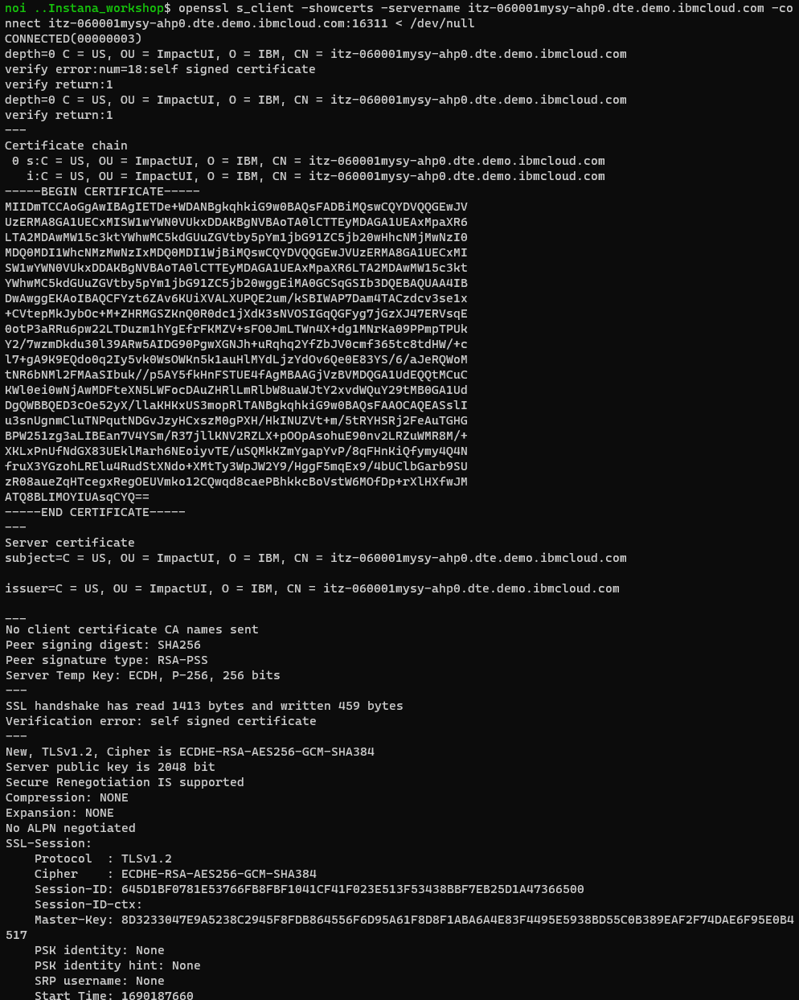
</picture>

      For the backend server (port 9081)
```sh
openssl s_client -showcerts -servername noi-impact.mycluster.com -connect noi-impact.mycluster.com:9081 </dev/null
```

Sample:
<picture>
  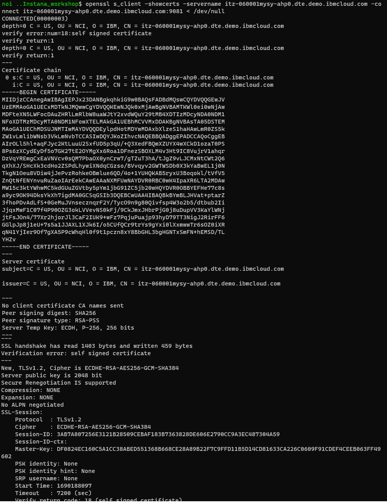
</picture>


Combine the Impact certificate for GUI server and Backend server.

```sh
touch ImpactCert
```

```sh
openssl s_client -showcerts -servername itz-060001mysy-ahp0.dte.demo.ibmcloud.com -connect itz-060001mysy-ahp0.dte.demo.ibmcloud.com:16311 < /dev/null >> ImpactCert

openssl s_client -showcerts -servername itz-060001mysy-ahp0.dte.demo.ibmcloud.com -connect itz-060001mysy-ahp0.dte.demo.ibmcloud.com:9081 < /dev/null >> ImpactCert
```

Edit ImpactCert:

<picture>
  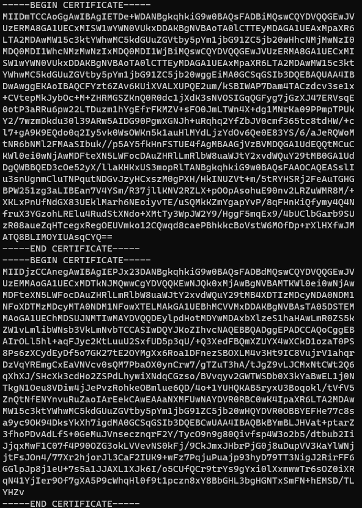
</picture>

Adding Impact Connection:


<picture>
  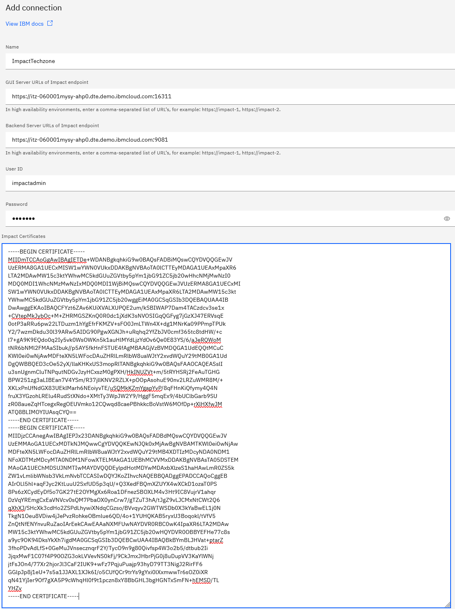
</picture>

<picture>
  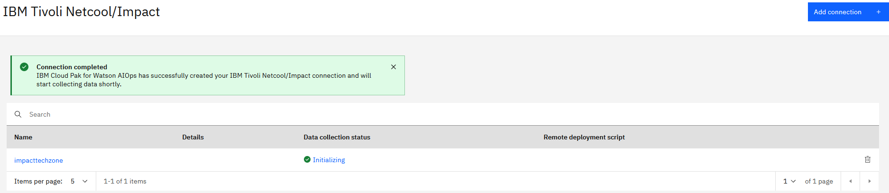
</picture>


> Note: There is an issue with the URL to Impact Server. As the FQDN of Impact is not resolveable, the following is the workaround.Basically, adding ConfigMap that define the FQDN name in the "/etc/host". The created ConfigMap will be added manually in the connector Instance.

Create the ConfigMap:

```sh
oc -n cp4waiops apply -f - <<EOF
apiVersion: v1
kind: ConfigMap
metadata:
  name: custom-hosts
data:
  customhosts: |
    150.238.132.58  itz-060001mysy-ahp0.dte.demo.ibmcloud.com
EOF
```

Add Volume to "Impact-connector" deployment. Need to find the right time to add and save as this deployment will auto update regularly.

```sh
        - name: hosts-volume
          configMap:
            name: custom-hosts
            items:
              - key: customhosts
                path: hosts
```

<picture>
  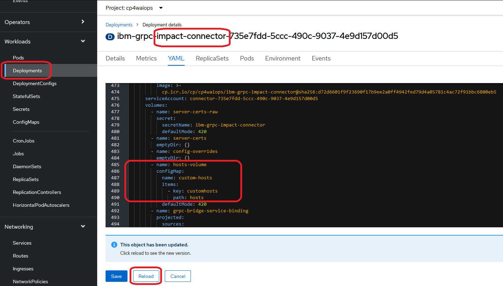
</picture>


Update the Volume Mount:

```sh
            - name: hosts-volume
              mountPath: /etc/hosts
              subPath: hosts
```

<picture>
  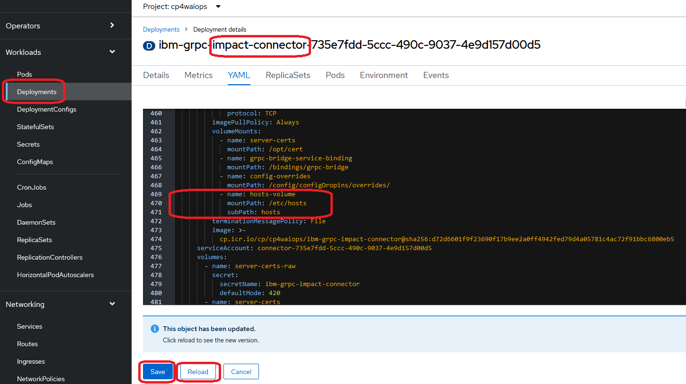
</picture>

The impact-connector pod will has the "/etc/hosts" updated:

<picture>
  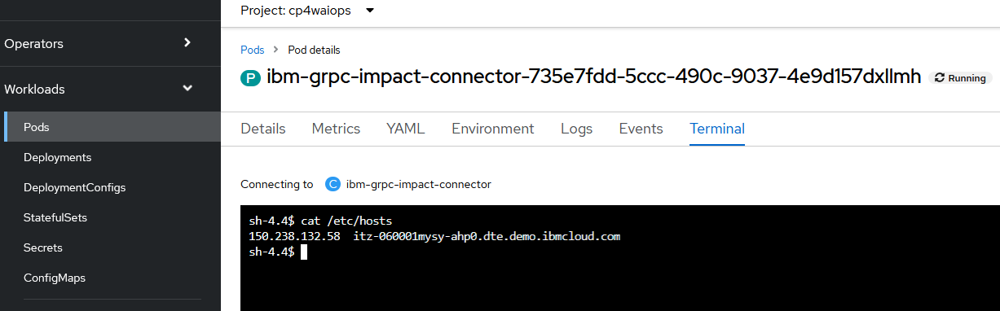
</picture>


The Impact Connector will be Running:
<picture>
  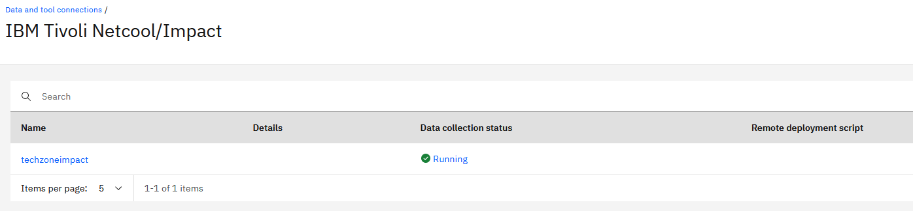
</picture>


Configuring a connection in IBM Tivoli Netcool/Impact for IBM Cloud Pak for Watson AIOps [Ref](https://www.ibm.com/docs/en/cloud-paks/cloud-pak-watson-aiops/4.1.0?topic=connections-configuring-connection-in-tivoli-netcoolimpact)

Find CP4AIOPS cluster address:
```sh
oc get route -n ibm-common-services cp-console -o jsonpath='{.spec.host}' && echo
```

Example:
cp-console.itzroks-060001mysy-92jnys-6ccd7f378ae819553d37d5f2ee142bd6-0000.jp-osa.containers.appdomain.cloud

To get the password for admin user
```sh
oc -n ibm-common-services get secret platform-auth-idp-credentials -o jsonpath='{.data.admin_password}' | base64 -d && echo
```

Generating API key [Ref](https://www.ibm.com/docs/en/cloud-paks/cloud-pak-watson-aiops/4.1.0?topic=apis-accessing#apikey)

Goto Prfile Setting:

<picture>
  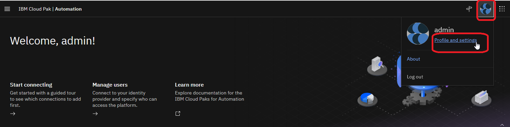
</picture>


<picture>
  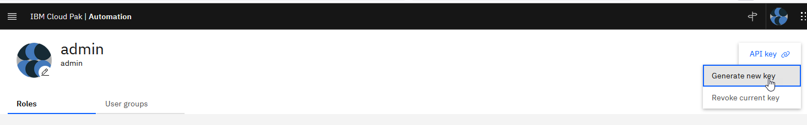
</picture>

Example:
```sh
MUkPkKCPgeCpTrwNieeAn19lLePvFKUzgM9Y8Dp5
```

# Generate the Platform UI API Key:
```sh
ZENAPIKEY=$(echo "admin:MUkPkKCPgeCpTrwNieeAn19lLePvFKUzgM9Y8Dp5" | base64 -w 0)
```

```sh
echo $ZENAPIKEY
```

Sample:
```sh
YWRtaW46TVVrUGtLQ1BnZUNwVHJ3TmllZUFuMTlsTGVQdkZLVXpnTTlZOERwNQo=
```


Construct your Authorization header with the Platform UI API Key.

Sample:
```sh
--header "Authorization: ZenApiKey YWRtaW46TVVrUGtLQ1BnZUNwVHJ3TmllZUFuMTlsTGVQdkZLVXpnTTlZOERwNQo="
```

Run the following cURL command:
```sh
curl "https://<Endpoint URL>" --header 'Content-Type: application/json' --header "Authorization: ZenApiKey <ZenApiKey>" --header 'X-TenantID: cfd95b7e-3bc7-4006-a4a8-a73a79c71255' --insecure
```

[The Endpoint URL as specified on the API page of the service that you want to use, for example, you can find the Endpoint URL for metrics](https://www.ibm.com/docs/en/cloud-paks/cloud-pak-watson-aiops/4.1.0?topic=apis-metric-api)

Example: (Not working)
```sh
curl "https://cpd-aiops.apps.itzroks-060001mysy-92jnys-6ccd7f378ae819553d37d5f2ee142bd6-0000.jp-osa.containers.appdomain.cloud/aiops/api/app/metric-api/v1/metrics" --header 'Content-Type: application/json' --header "Authorization: ZenApiKey YWRtaW46TVVrUGtLQ1BnZUNwVHJ3TmllZUFuMTlsTGVQdkZLVXpnTTlZOERwNQo=" --header 'X-TenantID: cfd95b7e-3bc7-4006-a4a8-a73a79c71255' --insecure
```


You can verify that your API key works by running the following command:
```sh
curl -kv -H "Authorization: ZenApiKey ${ZenApiKey}" -H "x-tenant-id: ${tenant_id}"  "https://${CPD_ROUTE}/aiops/api/issue-resolution/v1/alerts/"
```

Example:
```sh
curl "https://cpd-cp4waiops.itzroks-060001mysy-92jnys-6ccd7f378ae819553d37d5f2ee142bd6-0000.jp-osa.containers.appdomain.cloud" --header 'Content-Type: application/json' --header "Authorization: ZenApiKey YWRtaW46TVVrUGtLQ1BnZUNwVHJ3TmllZUFuMTlsTGVQdkZLVXpnTTlZOERwNQo="  --header 'X-TenantID: cfd95b7e-3bc7-4006-a4a8-a73a79c71255' --insecure
```
>Not sure whether the following is correct??
<picture>
  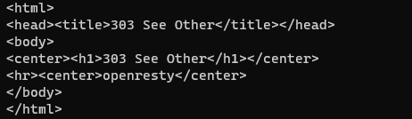
</picture>


Configuring the for RESTful DSA data source

- AIOPS_HandleAction - This file defines the wrapper that is used when IBM Cloud Pak for Watson AIOps invokes an action in IBM Tivoli Netcool/Impact.

- AIOPS_Mappings - This file defines how events are sent, and mapped, to IBM Cloud Pak for Watson AIOps.

- AIOPS_Utils - This file lists the APIs that are used for communicating with IBM Cloud Pak for Watson AIOps.

<picture>
  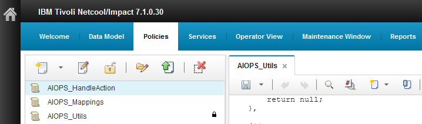
</picture>


Update AIOPS Data Model:

For Impact to connect to CP4AIOPs, the certification need to be imported.
Get the certificate for CP4AIOPs:

```sh
openssl s_client -showcerts -servername cpd-cp4waiops.itzroks-060001mysy-92jnys-6ccd7f378ae819553d37d5f2ee142bd6-0000.jp-osa.containers.appdomain.cloud -connect cpd-cp4waiops.itzroks-060001mysy-92jnys-6ccd7f378ae819553d37d5f2ee142bd6-0000.jp-osa.containers.appdomain.cloud:443 < /dev/null > ~/cp4aiops.cert
```

Cut cp4aiops.cert to look as follow:

<picture>
  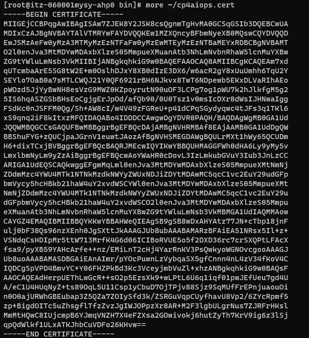
</picture>

Importing the certificate chain into the trust store of Impact [Ref](https://www.ibm.com/docs/en/tivoli-netcoolimpact/7.1?topic=security-enabling-ssl-connections-external-servers).

```sh
/opt/IBM/tivoli/impact/sdk/bin/keytool -importcert -alias cp4aiopscert -file ~/cp4aiops.cert -keystore /opt/IBM/tivoli/impact/wlp/usr/servers/NCI/resources/security/trust.jks -storepass Netc00l
```

Restart Impact Server and GUI.

Configure the AIops Data Model.

To get the host Name of AIOps:
```sh
oc get route -n cp4waiops cpd  -o jsonpath='{.spec.host}' && echo
```

Hostname:
```sh
cpd-cp4waiops.itzroks-060001mysy-92jnys-6ccd7f378ae819553d37d5f2ee142bd6-0000.jp-osa.containers.appdomain.cloud
```

Authorization:
```sh
ZenApiKey YWRtaW46TVVrUGtLQ1BnZUNwVHJ3TmllZUFuMTlsTGVQdkZLVXpnTTlZOERwNQo=
```

<picture>
  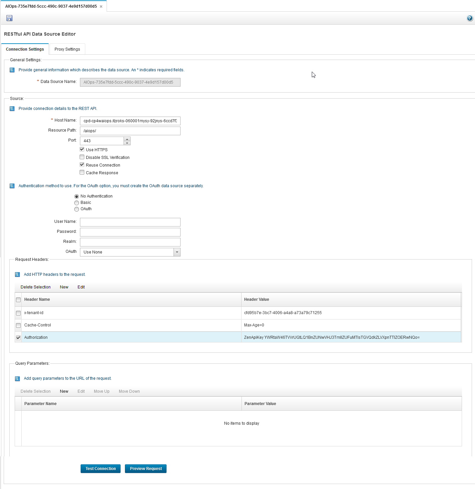
</picture>


Verifying the connection

Template for policy to create an alert in CP4AIOPS.
```sh
Load('AIOPS_Utils');
occurrenceTime = new Date();
var myEventInstance = "<instance_name>";
var event = {
    deduplicationKey: myEventInstance + " <event_name>",
    sender: {
      service: "<service>",
      name: "<sender_name>",
      type: "Success",
      location: "<location>",
      cluster: "\"quotes\"",
      controller: "<script>alert(\"<sender_controller>\");</script>"
    },
    resource: {
      name: myEventInstance + "<resource_name>",
      type: myEventInstance + " <type>",
      service: myEventInstance + " <service>",
      location: "<location>",
      controller: "<resource_controller>",
      interface: "<interface>",
      ipAddress: "<ip_address>",
      hostname: "<hostname>",
      cluster: "<cluster>"
    },
    type: {
      classification: myEventInstance + " <classification>",
      eventType: "<event_type>"
    },
    severity: 6,
    summary: myEventInstance + " <summary>",
    occurrenceTime: occurrenceTime.toISOString()
  };
var res = aiopsUtils.postEventDSA( "AIOps-<UUID>" , event );
Log("res: " + res);
```

To obtain the UUID value to use for the aiopsUtils.postEventDSA( "AIOps-<UUID>" , event ) setting, run the following command:

jq is needed to run the command. To install [jq](https://jqlang.github.io/jq/download/)

In Ubuntu:
```sh
sudo apt-get install jq

```sh
oc get connectorconfiguration -o json | jq -r '.items[] | (.metadata.name + " - " + .metadata.uid)'
```

Sample:
```sh
techzoneimpact - 735e7fdd-5ccc-490c-9037-4e9d157d00d5
```

Sample Policy:
```sh
Load('AIOPS_Utils');
occurrenceTime = new Date();
var myEventInstance = "MyInstance";
var event = {
    deduplicationKey: myEventInstance + " My Event",
    sender: {
      service: "My Service",
      name: "Me",
      type: "Success",
      location: "My Location",
      cluster: "\"quotes\"",
      controller: "<script>alert(\"My Controller\");</script>"
    },
    resource: {
      name: myEventInstance + "My Resource name",
      type: myEventInstance + " My Type",
      service: myEventInstance + " My Service",
      location: "My Location",
      controller: "My Controller",
      interface: "My interface",
      ipAddress: "My IP Address",
      hostname: "My Hostname",
      cluster: "My Cluster"
    },
    type: {
      classification: myEventInstance + " My Classification",
      eventType: "My EventType"
    },
    severity: 6,
    summary: myEventInstance + " My Summary",
    occurrenceTime: occurrenceTime.toISOString()
  };
var res = aiopsUtils.postEventDSA( "techzoneimpact - 735e7fdd-5ccc-490c-9037-4e9d157d00d5" , event );
Log("res: " + res);
```


