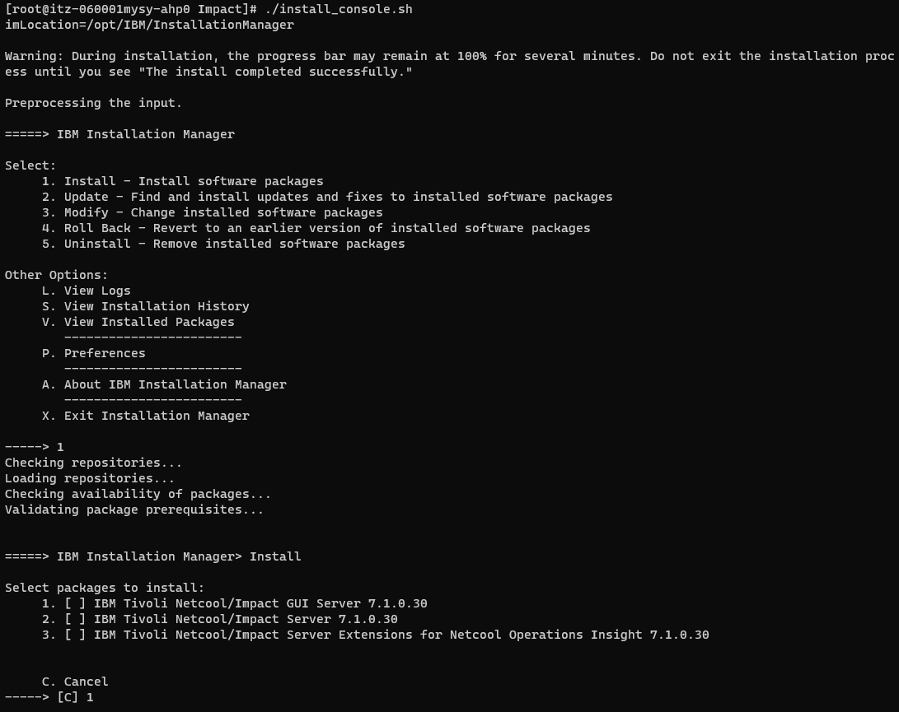
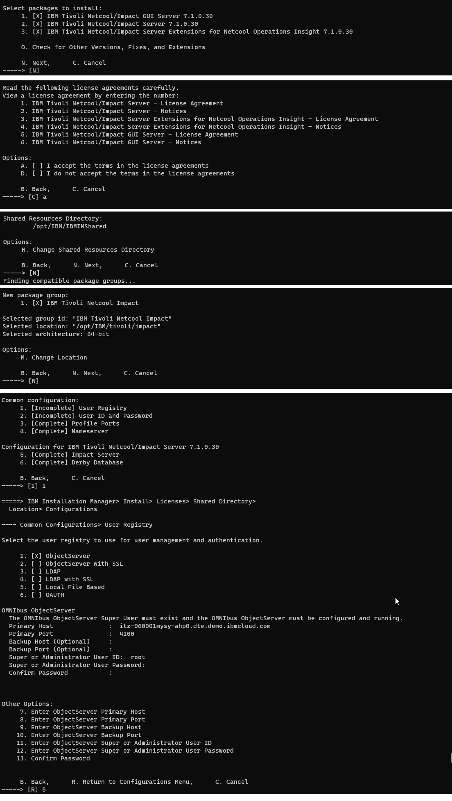
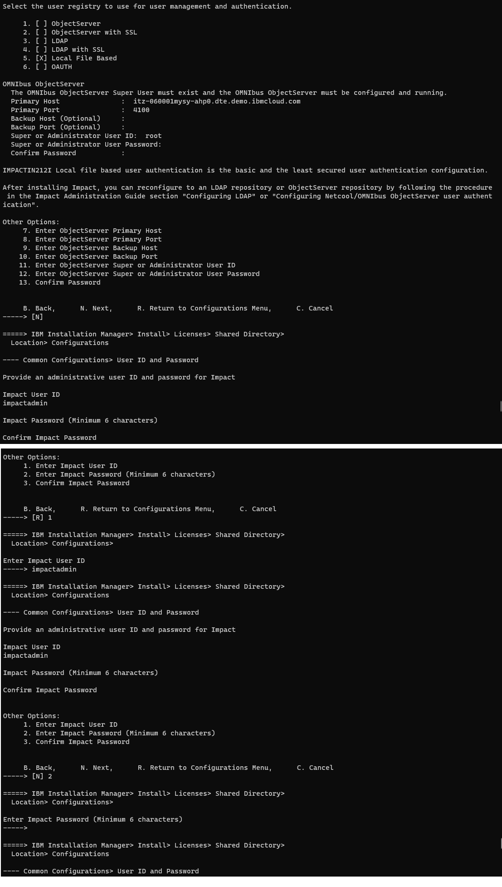
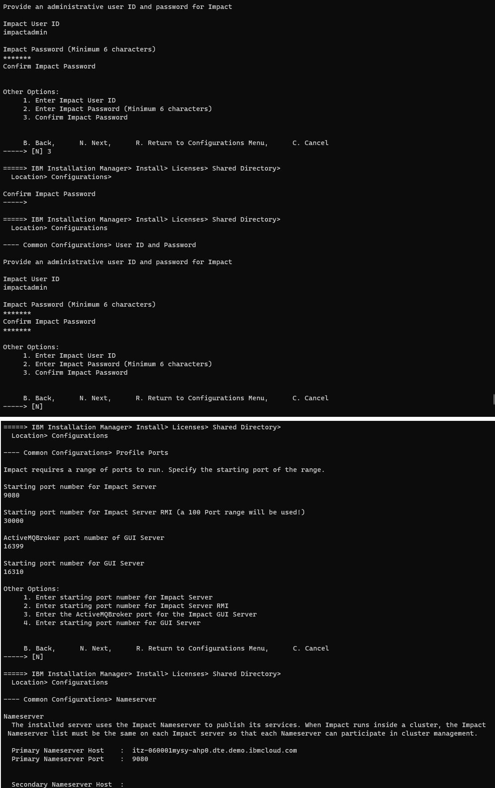
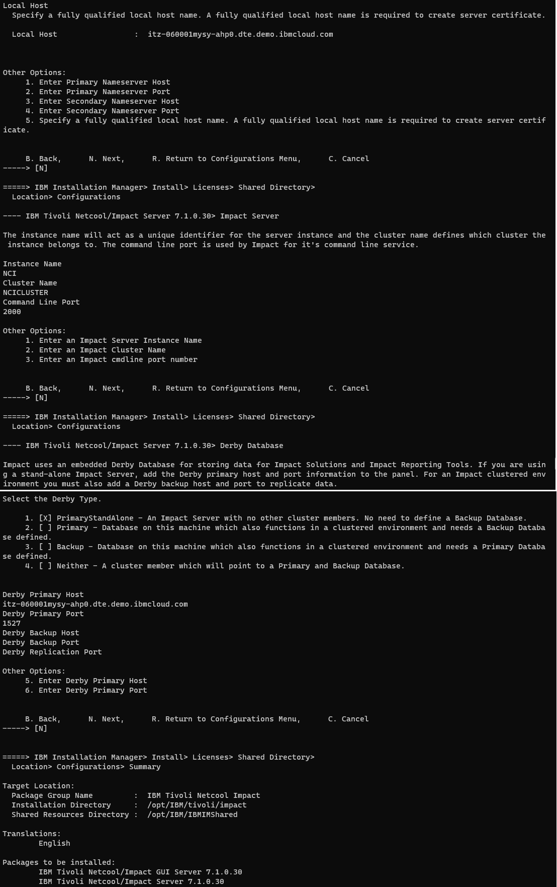
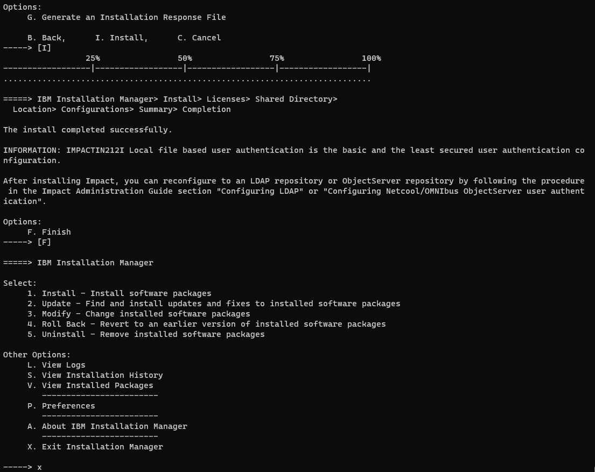

The installation is referencing [this](https://www.ibm.com/docs/en/tivoli-netcoolimpact/7.1?topic=mode-starting-installation)

The steps recorded here is using console mode:

```sh
./install_console.sh
```

<picture>
  
</picture>

<picture>
  
</picture>


<picture>
  
</picture>


<picture>
  
</picture>

> Note: the FQDN cannot start with numeric, i.e no IP Address

<picture>
  
</picture>

<picture>
  
</picture>


Logging into Impact GUI [here](https://www.ibm.com/docs/en/tivoli-netcoolimpact/7.1?topic=steps-logging-in-netcoolimpact-gui)


<picture>
  
</picture>


