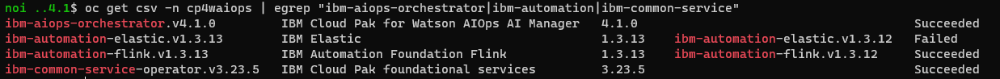
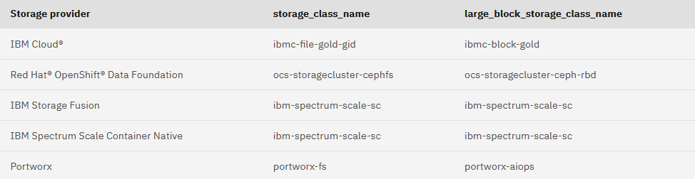
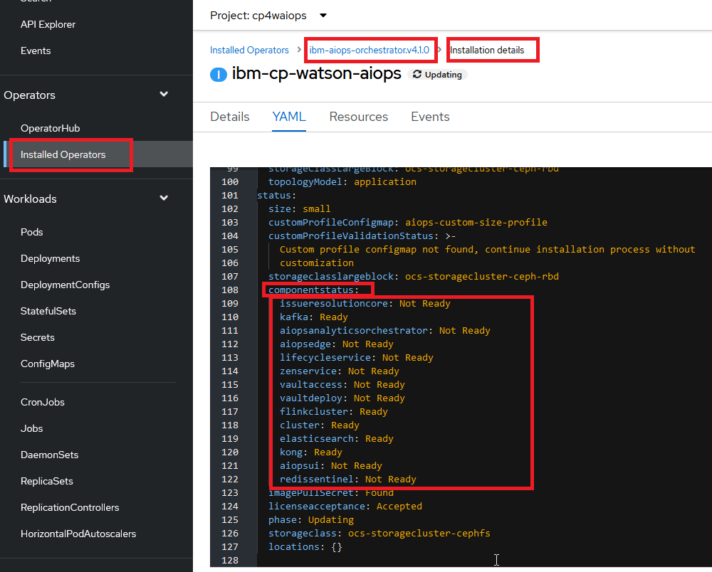

# Cloud Pak for AIOPS 4.1 on IBM ROKS (Starter Installation)

Supported Storage Provider on IBM Cloud
- Storage Class Name : ibmc-file-gold-gid
- Large Block Storage Class Name : ibmc-block-gold

## Create a custom project (namespace)
Create a project (namespace) called cp4waiops for your IBM Cloud Pak for Watson AIOps deployment, by running the following command:

```sh
oc create namespace cp4waiops
```

## Create an OperatorGroup in your custom project (namespace)
Create the Operator group by running the following command:

```sh
cat << EOF | oc apply -f -
apiVersion: operators.coreos.com/v1
kind: OperatorGroup
metadata:
  name: cp4waiops-operator-group
  namespace: cp4waiops
spec:
  targetNamespaces:
    - cp4waiops
EOF

```

## Create the entitlement key pull secret

Get the key [here](https://myibm.ibm.com/products-services/containerlibrary)

From the Red Hat OpenShift CLI, run the following command:
```sh
oc create secret docker-registry ibm-entitlement-key \
    --docker-username=cp\
    --docker-password=<entitlement-key> \
    --docker-server=cp.icr.io \
    --namespace=cp4waiops
```

## Disabling the collection of usage data
If you want to disable the collection of usage data, run the following commands.
Set environment variables.

```sh
export CUSTOMER_NAME=<your company name>
export CUSTOMER_ICN=<your IBM Customer Number>
export CUSTOMER_ENVIRONMENT=<Set to `trial`, `poc`, or `production`>
export PROJECT_CP4WAIOPS=cp4waiops

Example:
export CUSTOMER_NAME=IBM
export CUSTOMER_ICN=00000
export CUSTOMER_ENVIRONMENT=poc
export PROJECT_CP4WAIOPS=cp4waiops
```
Disable usage data collection
```sh
oc create secret generic aiops-metrics-processor -n ${PROJECT_CP4WAIOPS} --from-literal=customerName=${CUSTOMER_NAME} --from-literal=customerICN=${CUSTOMER_ICN} --from-literal=environment=${CUSTOMER_ENVIRONMENT} --from-literal=enableCollection=false 
```

## Create the catalog source

If you want to enable the automatic initiation of patch upgrades, run the following command to create the ibm-operator-catalog CatalogSource object with polling enabled.

```sh
cat << EOF | oc apply -f -
apiVersion: operators.coreos.com/v1alpha1
kind: CatalogSource
metadata:
  name: ibm-operator-catalog
  namespace: openshift-marketplace
spec:
  displayName: ibm-operator-catalog
  publisher: IBM Content
  sourceType: grpc
  image: icr.io/cpopen/ibm-operator-catalog:latest
  updateStrategy:
    registryPoll:
      interval: 45m
EOF
```

If you want to disable the automatic initiation of patch upgrades, then use the following steps.

Run the following command to create the ibm-operator-catalog CatalogSource object without polling enabled.

```sh
cat << EOF | oc apply -f -
apiVersion: operators.coreos.com/v1alpha1
kind: CatalogSource
metadata:
  name: ibm-operator-catalog
  namespace: openshift-marketplace
spec:
  displayName: ibm-operator-catalog
  publisher: IBM Content
  sourceType: grpc
  image: icr.io/cpopen/ibm-operator-catalog:latest
EOF
```
Validate that the CatalogSource resource was created. Using the oc CLI, run the following command:
```sh
oc get CatalogSources ibm-operator-catalog -n openshift-marketplace
```


Update the ibm-operator-catalog CatalogSource to fix it to always use the current image digest, instead of icr.io/cpopen/ibm-operator-catalog:latest. This ensures that the ibm-operator-catalog CatalogSource pods do not pull the latest image if a node reload or other issue causes them to restart. Run the following commands:

```sh
IMGDIGEST=`oc get pods -n openshift-marketplace -l=olm.catalogSource=ibm-operator-catalog --no-headers -o=jsonpath="{.items[0].status.containerStatuses[0].imageID}" -n openshift-marketplace` && \
oc patch catalogsource ibm-operator-catalog -n openshift-marketplace --type=json -p "[{ "op": "test", "path": "/spec/image", "value": "\"icr.io/cpopen/ibm-operator-catalog:latest\"" }, { "op": "replace", "path": "/spec/image", "value": "\"$IMGDIGEST\"" }]"
```

## Verify cluster readiness

```sh
git clone https://github.com/IBM/cp4waiops-samples
cd cp4waiops-samples/prereq-checker/4.1

oc project cp4waiops
chmod +x prereq.sh
./prereq.sh
```

## Install the IBM Cloud Pak for Watson AIOps operator

```sh
cat << EOF | oc apply -f -
apiVersion: operators.coreos.com/v1alpha1
kind: Subscription
metadata:
  name: ibm-aiops-orchestrator
  namespace: cp4waiops
spec:
  channel: v4.1
  installPlanApproval: Automatic
  name: ibm-aiops-orchestrator
  source: ibm-operator-catalog
  sourceNamespace: openshift-marketplace
EOF
```
After a few minutes, the IBM Cloud Pak for Watson AIOps operator is installed. Verify that the all of the components have a state of Succeeded by running the following command:

```sh
oc get csv -n cp4waiops | egrep "ibm-aiops-orchestrator|ibm-automation|ibm-common-service"
```

**Important:** A dependency may not yet be present when this command is run, and cause IBM Elastic to be Failed. This dependency is resolved when the custom resource is created and rollout continues. No user intervention or delay is required. 

<picture>
  
</picture>

The IBM Elastic will continue to be failed until moving to the next [step 10](https://www.ibm.com/docs/en/cloud-paks/cloud-pak-watson-aiops/4.1.0?topic=aiops-starter-installation#exp_instance)

> Note: Replace <license_acceptance>, <storage_class_name> and <large_block_storage_class_name>

<picture>
  
</picture>

Example:
```sh
cat << EOF | oc apply -f -
apiVersion: orchestrator.aiops.ibm.com/v1alpha1
kind: Installation
metadata:
  name: ibm-cp-watson-aiops
  namespace: cp4waiops
spec:
  imagePullSecret: ibm-entitlement-key
  license:
    accept: true
  pakModules:
  - name: aiopsFoundation
    enabled: true
  - name: applicationManager
    enabled: true
  - name: aiManager
    enabled: true
  - name: connection
    enabled: false
  size: small
  storageClass: ocs-storagecluster-cephfs
  storageClassLargeBlock: ocs-storagecluster-ceph-rbd
  topologyModel: application
EOF
```

Some check on the installation progresss:

<picture>
  
</picture>

All pod in Common Services should be Running and Completed.
```sh
oc get pod -n ibm-common-services
```

> Note: Increase the Storage Size of Kafka to 120GB
```sh
oc patch automationbase/automationbase-sample --type merge -p '{"spec":{"kafka":{"kafka":{"storage":{"size":"120Gi"}}}}}'
```


