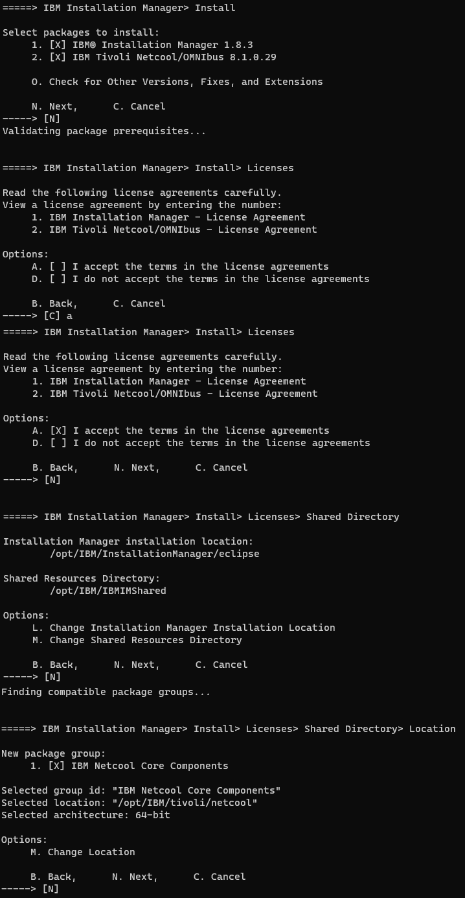
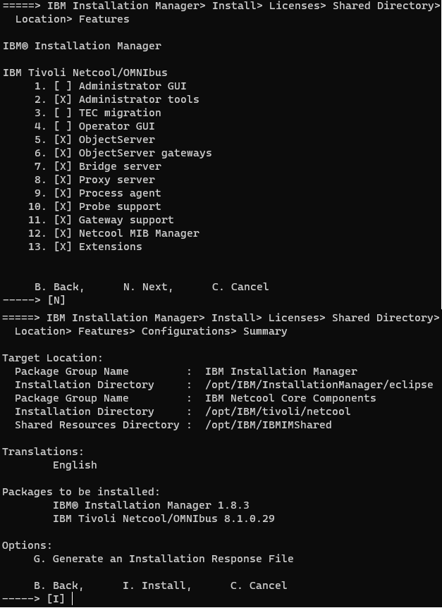
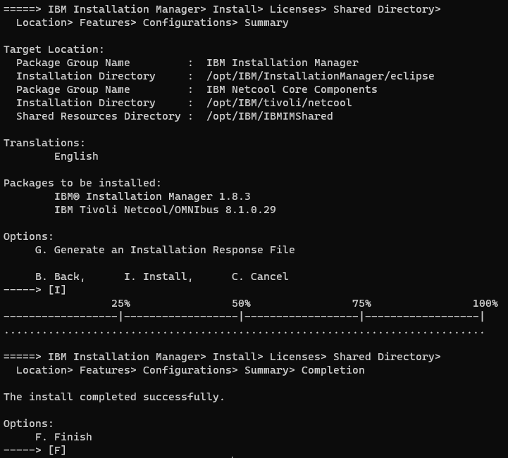

Omnibus Installation

```sh
mkdir omnibus
cd omnibus
mv <Download>/TVL_NTCL_OMN_V8.1.0.29_CORE_LNX.zip .
unzip TVL_NTCL_OMN_V8.1.0.29_CORE_LNX.zip
unzip com.ibm.tivoli.omnibus.core.linux.x86_64.zip
```

Install Omnibus using console
```sh
./install_console.sh
```

<picture>
  
</picture>

<picture>
  
</picture>

<picture>
  
</picture>


