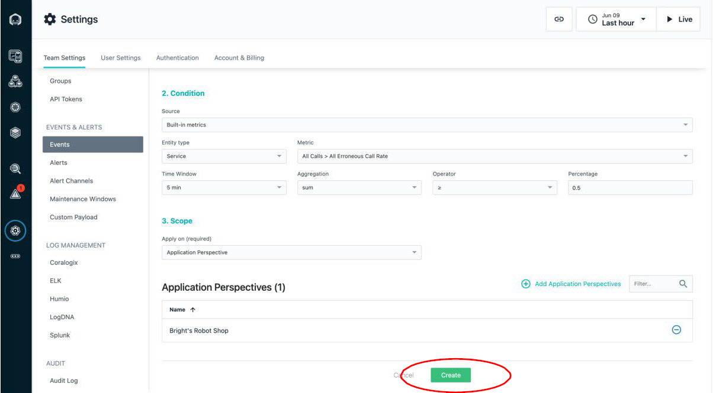
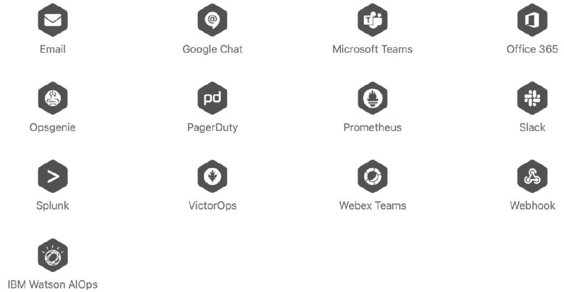

# Part 3. Advanced Topics

# Lab 3.1 – Events, analytics and troubleshooting

**Key Concepts**

Event

In Instana, there are 3 types of events: incidents, issues and changes.
- Incidents yield the highest severity level, which are created when edge services accessed by end-users are impacted or there is an imminent risk of impact;

- An Issue is an event that gets created if an application, service or any part of it gets unhealthy.

<picture>
  
</picture>

Goal

  1. To understand the mechanisms Instana offers for anomaly detection
  2. To walk through a typical troubleshooting process
  3. To understand how to customize Event rules

Steps

1. The mechanisms Instana offers to highlight anomalies

In the landing page of Instana, it will highlight if there are any incidents:

<picture>
  
</picture>

On the menu item of “Events”:

<picture>
  
</picture>

Or embedded within the services:

<picture>
  
</picture>

Setting up alert rules and alert channels can be a handy way too to stay informed:

<picture>
  
</picture>

2. Explore the Instana Events

We can click the “Events” menu item to see all aggregated events. Default is the incident view:

<picture>
  
</picture>

If you click the incident, you will see something like this, where it captures all the important correlated elements:

<picture>
  
</picture>


Click “All” to see all events from all types:

<picture>
  
</picture>

Click “Issues” to see issues detected:

<picture>
  
</picture>

Click any of the issues, we can see much more details with evidence too:

<picture>
  
</picture>

Click “Changes” to see changes detected:

<picture>
  
</picture>

Click any of the changes, we can see details like what are changed, and when:

<picture>
  
</picture>


3. Browse the built-in event rules

Built-in events are predefined health signatures based on integrated algorithms which help you to understand the health of your monitored system in real-time. There are hundreds of built-in event use cases and rules, please refer to this link for what they are: https://www.ibm.com/docs/en/instana-observability/current?topic=references- built-in-events-reference. Please note that, these built-in event rules not only cover the generic use cases, but also embed a lot of SRE knowledge and practices too for every specific component like public clouds, language runtimes, middleware, databases, etc.

<picture>
  
</picture>

4. Let’s purposely “inject” some issues

We can achieve that by updating the “load-gen” we installed in “Lab2 – Website Monitoring”:

Deploy the load-gen App

```sh
$ kubectl -n robot-shop apply -f - <<EOF
apiVersion: apps/v1
kind: Deployment
metadata:
  name: load
  labels:
    service: load
spec:
  replicas: 1
  selector:
    matchLabels:
      service: load
  template:
    metadata:
      labels:
        service: load
    spec:
      containers:
      - name: load
        env:
          - name: HOST
            value: "http://web:8080/"
          - name: NUM_CLIENTS
            value: "5"
          - name: SILENT
            value: "1"
          - name: ERROR
            value: "1"                     # enable it now
        image: robotshop/rs-load:latest
EOF
```
5. Let’s see what Instana has detected

Click the Application icon, filter by our application’s name, and click to open the AP dashboard:

<picture>
  
</picture>

We can see the erroneous calls:

<picture>
  
</picture>

And yes, it’s detected – to avoid the noise, you can filter the issues too:

<picture>
  
</picture>


Click the issue to see more details:

- The title of “Sudden increase in the number of erroneous calls” is already quite meaningful, with a tag of “SERVICE IMPACT” – yes, this case is service level, the calls to “POST /pay/partner-57” is intentionally erroneous
- There is a start and end time. Since this issue is new and still active, no end time
- The description provides more accurate info: Absolute change: 25%
- The metrics as a way to illustrate the change visually

<picture>
  
</picture>


7. Click to analyze the erroneous calls

It will automatically populate the filter for what we care, and identify that
these issues come from one Endpoint with pattern of “POST /pay/{id}”:

<picture>
  
</picture>

Click the Endpoint to list out all erroneous calls – in this case all are “POST /pay/partner-57” from time to time:

<picture>
  
</picture>

Click any of them and we will be redirected to the detailed call analytics, where we can see trace, timeline, service endpoint list, calls and logs as a whole context:

<picture>
  
</picture>

From this view, we can clearly see the how these services are interacted and what caused the issue:

<picture>
  
</picture>

From the right side, we even can see the infrastructure underneath, and the stack trace for what exactly caused the issue, if any!

<picture>
  
</picture>

For those dynamic programming languages like Java, Python, PHP, Node.js etc., we even can tell “which line of code caused the issue”:

<picture>
  
</picture>


8. Figure out how Instana handles event with more findings

If you go back to “Issue” page and filter by the same filters, you might be surprised that the “Issue” might be gone, especially when you select a smaller time window, say “Last 5 minutes”. Why?

If you recall the Event rule that detected the issue, which was “Sudden increase in the number of erroneous calls”, when such erroneous calls become a “new normal”, this rule would have become not true.

Let’s take a deeper look at this Event rule:
- Filter with “built-in” rule, with search keyword of “Sudden increase in erroneous call rate”
- Pick the one with “Service” type

<picture>
  
</picture>

Now we can see all details how this built-in Event rule is defined:
- It detects a rapid increase in the values of the erroneous call rate metric relative to the values in the last 10 minutes
- Relative metric value shift: 10%

<picture>
  
</picture>

So if the erroneous rate has stabilized after 10 minutes with a rate like 5%, this 5% has become a “new normal” and it won’t trigger any new “Issue” by this rule.

But this sounds wired at first, right? But such design can capture the changes and significantly reduce the alert storm. And don’t forget, there are different rules for different use cases.

If you conduct a quick search with keyword of “erroneous call”, there are more rules for different scenarios that you might be looking for:

<picture>
  
</picture>

Similarly, click the one with “Entity type” as “Service”:

<picture>
  
</picture>

This rule namely “Erroneous call rate too high” is defined with a parameter: Error rate threshold = 50%.
Obviously, our purposely “created” error rate is <5%, which won’t trigger this event rule.

<picture>
  
</picture>


But how if some of our services are really critical and the SLA of “error rate” is 0.5% or less? Simple answer is: we may need to customize our Event rule. Please read on.


9. Customize Event rules

A custom Event enables you to create issues or incidents based on an individual metric of any given entity, with desired configuration.
Click the “New Event” to start:

<picture>
  
</picture>

Fill up the form with these inputs.

1. Event Details
- Name: Custom – Student {n} - Erroneous call rate for critical services >= 0.5%
- Description: Detects a consistently erroneous call rate for critical services >= 0.5%
- Issue Severity: Critical
- Incident: No, by default
- Grace Period: 5 min

2. Condition
- Source: Build-in metrics
- Entity type: Service
- Metric: All calls > All Erroneous Call Rate
- Time Window: 5 min
- Aggregation: avg
- Operator: ≥
- Percentage: 0.5

3. Scope
- Apply on: Application Perspectives
- Click “Add Application Perspectives” and pick our AP created in previous lab. Please pick exactly the one you created, with the right application name like “Student-{n} Robot Shop App”.

<picture>
  
</picture>

<picture>
  
</picture>

Then click the “Create” button.


We can wait for a while, remember that the grace period we set was 5 min, and we should be able to see there is a Critical issue under Issues tab, which is in “active” status:

<picture>
  
</picture>

Click into it and we can see the details.

<picture>
  
</picture>

As this Event rule detects the average of the erroneous rate within every 5
min time window, it will keep on “active” status until the rate is <=0.5%.


10. Pause the Event rules

We can toggle the event rule to be active/paused.
Let’s filter and list out our custom Event rule, click the pause button to disable it.

<picture>
  
</picture>


**Takeaways**

As you could see from this lab, Instana highlights incidents and offers full flexibility to detect anomalies by using hundreds of built-in Event rules or customized ones.

The down-to-the-code analysis that brings together the calls, services, latencies, traces, logs etc. with a well-organized context for our troubleshooting can easily take us from the issue to the proper actions that fix the problems well within our committed SLAs.


# Lab 3.2 – Alerts & Channels

**Key Concepts**

**Alert**
Alert is an event when something abnormal detected by event rules and/or
Instana’s internal anomaly detection engine.

**Alert Channel**
Alert Channel is the mechanism that the alert message is being sent through. Typically, this can be integrated with some commonly used alerting systems/channels like Email, Slack, PagerDuty, Google Chat etc., or even generic Webhook.

**Goal**
1. To understand what alert channels Instana supports out of the box
2. To understand how to create an alert channel
3. To understand how to define an alert with one or more alert channels


**Steps**
1. The alert channels Instana currently supports
Click “Settings” -> “Alert Channels” -> “Add Alert Channel”, we can see what
alert channels Instana currently supports.

<picture>
  
</picture>

In short, these alert channels and/or mechanisms are currently supported:

<picture>
  
</picture>


2. Create an alert channel with email

> NOTE: this cannot be done within our newly spun up Instana Server as the SMTP server hasn’t been set up yet. But this can be achieved if we’re using SaaS instances.

The simplest alert channel might be email.

Client “Add Alert Channel” button and select “Email” from the dropdown list:

<picture>
  
</picture>


We can simply key in two elements:
- Name: whatever name makes sense to you, for example “My Email Alert Channel”
- Emails: we can add as many as emails as you want

<picture>
  
</picture>

Then click the “Test Channel”, it will trigger a test event. In this Email Channel case, it will send out a test email to configured email(s), the content looks like this:

<picture>
  
</picture>


3. Create an alert

Click “Settings” -> “Alerts”, it will list down all created alerts. Click “New Alert” to start creating our own alert:

<picture>
  
</picture>


Let’s fill up the form with:
- Name: whatever name makes sense to you, for example, My Email Alert
- Events: there are two types: Alert on Event Type(s); Alert on Event(s).

  Let’s pick Alert on Event(s) for this lab;

- Events: Let’s pick our newly created customized Event namely “Custom - Erroneous call rate for critical services >= 0.5%”
- Scope: Let’s pick Application Perspectives with our own AP
- Alert Channels:

<picture>
  
</picture>


So it eventually looks like this:

<picture>
  
</picture>

Now let’s click the “Create” button to create it.

<picture>
  
</picture>


Please note that once it’s created, it’s enabled by default. We can disable or even delete it anytime by clicking the pause and delete buttons respectively.

4. Let’s enable the previous Event rule

At the end of “Lab 5 - Events, analytics and troubleshooting” we’ve disabled the Event rule and now let’s enable it:

<picture>
  
</picture>

It can be enabled immediately.

<picture>
  
</picture>


Almost at the same time, it will trigger the alert, with an email received:

<picture>
  
</picture>


The link embedded in the email can bring us to the exact “crime scene” so that we can kick off the root cause analysis journey in the previous lab.

As there is a grace period of 5 mins, the event can be appeared in the “Issues” too:

<picture>
  
</picture>


**Takeaways**

As you could see from this lab, Instana provides a series of out-of-the-box Alert Channels that can significantly simplify the way for SRE/operator to stay informed for potential issues – you may send “issues” through “normal” email, while urgent “incidents” through PagerDuty – the choice is all yours! We can easily integrate the events with the alerts so we, as the SRE/operator, can always be proactive.

The integration capability of alerts also improves the observability while combining more operational data, like topology, to form a modern AIOps by using platforms like IBM Cloud Pak for Watson AIOps.


# Lab 3.3 – SLO Monitoring with Custom Dashboard

**Key Concepts**

**Service Level Objectives**

A service-level objective (SLO) is a key element of a service-level agreement (SLA) between a service provider and a customer. As an example, this may become a SLO of “app availability”: The application will be available 99.95% of the time.

**Service Level Indicator**

A service level indicator (SLI) is the defined quantitative measure of one characteristic of the level of service that is provided to a customer. SLIs are the metric of SLOs.

**Error Budget**

The specified target value of an SLO implicitly defined a small budget where the service is allowed to not work fully reliable. This error budget allows to incorporate planned or unplanned downtime of the service that is unavoidable in practice. From above 99.95% of “app availability” SLO, it indicates that there is 0.05% error budget.

**Goal**

While Instana provides comprehensive dashboards to support common use- cases and remove the necessity for custom dashboards, there are situations where a custom dashboard is the right view for the job.


There are three custom dashboarding options with Instana:
1. Build native custom dashboards from directly within Instana.
2. Leverage Instana’s Grafana plug (https://www.instana.com/docs/ecosystem/grafana/) in when you'd like to combine Instana data with other data sources, or if you have advanced dashboarding needs.
3. Query our Web REST API (https://www.instana.com/docs/api/web/) and build dashboards in the tool of your choice for complete flexibility.

The goal of this lab is to cover scenario #1: to build native custom dashboard from directly within Instana, to cover the needs of building an SLO-oriented dashboard.

**Steps**

1. Create a custom Dashboard
Click the Instana icon, it will show the default dashboard. Click the dropdown and we can click the “Create Dashboard” button to start:

<picture>
  
</picture>


In the prompt, let’s give it a name say “Custom – Student{n} - SLO
Monitoring”, and click “Create”:

<picture>
  
</picture>


We will be redirected to our newly created dashboard, which is blank now.

<picture>
  
</picture>


2. Add a time-based widget
Click the “Add Widget” to add a new widget:

<picture>
  
</picture>


There are a couple of widget types we can choose from:

<picture>
  
</picture>


Let’s have a look at what Instana offers:

<picture>
  
</picture>
<picture>
  
</picture>


Hey, there is a dedicated SLO widget, let’s pick it and click “Next”:

<picture>
  
</picture>


3. Configure the first widget

<picture>
  
</picture>


Let’s pick our own Application Perspective name for “Application Perspective User Journey / Offering”. In my case, it’s “Bright’s Robot Shop”:

<picture>
  
</picture>


We may not have a predefined SLI yet, no worries, click “Manage SLIs”
button to create one:

<picture>
  
</picture>

<picture>
  
</picture>


Let’s define a “Service Latency” SLI with:
SLI Customization:
- Name: Service Latency - Catalogue Service
- Type: Time-based SLI Entity:
- Boundary: Inbound Calls
- Service: catalogue
- Endpoint: All Services Metric & Threshold:
- Metric: Latency
- Aggregation: 95th
- Threshold (ms): 200

<picture>
  
</picture>


Click “Create” button to create it, and click the “ SLI Management” to go
back to our widget configuration page:

<picture>
  
</picture>


And let’s select it, with below configuration: 
SLO Configuration:

- Application Perspective: your AP’s name, e.g. Bright’s Robot Shop
- Service Level Indicator: the one you just created, e.g. Service Latency - Catalogue Service
- SLO Target: 99 %
- Time Window: Dynamic time window Widget Name:
- Name: SLO - Catalogue Service

There is a good preview for how the SLO will look lick. Click “Create”
button to create this SLO widget.

<picture>
  
</picture>


Do remember to click the “Save changes” to save it.

<picture>
  
</picture>


4. Add another event-based widget

Similarly, let’s quickly go through these steps to add an event-based widget:
Now let’s

<picture>
  
</picture>


Now let’s create the SLI with:
SLI Customization:
- Name: Event SLI - Bright's Robot Shop
- Type: Event-based SLI Entity:
- Boundary: Inbound Calls
- Service: catalogue
- Endpoint: All Services 
Good Events:
- Call Erroneous is false 
Bad Events:
- Call Erroneous is true OR Call Latency >=5000

<picture>
  
</picture>


5. Configure the second widget

And let’s select the newly created SLI and configure the widget as below: 

SLO Configuration:
- Application Perspective: your AP’s name, e.g. Bright’s Robot Shop
- Service Level Indicator: the one you just created, e.g. Service Latency - Catalogue Service
- SLO Target: 95 %
- Time Window: Dynamic time window 
Widget Name:
- Name: SLO – Robot Shop Events

<picture>
  
</picture>


Click “Create” button and it will return to the custom dashboard.
Note: you may move to the widget and some buttons will be appeared, by which we can move, edit, duplicate, delete the widget.

<picture>
  
</picture>


6. Save the custom dashboard

You may add more widgets too, if you want.
But don’t forget, click the “Save changes” to save the custom dashboard!

<picture>
  
</picture>


7. More options for our custom dashboard

Once clicked the “…” button on top right, there are more:

- TV Mode: This is to become “full screen” so it’s perfect to project it to TV.
- Make Default: Make this dashboard as default in the landing page after login. But don’t worry, this is user-based preference so won’t impact others.
- Edit Name: This is to edit the dashboard name
- Edit As JSON: This is to edit the dashboard in JSON format – this is coolespecially when we’re editing some metric numbers.
- Duplicate: This is to duplicate the dashboard.
- Delete: This is to delete the dashboard.

<picture>
  
</picture>


And by default, the custom dashboards are private, which means that only the author can see them. We can click the “Share” button to make it public.

<picture>
  
</picture>


**Takeaways**

As you could see from this lab, Instana provides a built-in support for how to define SLO-oriented widgets which can easily be part of our custom dashboards to visualize the most important part of SRE commitment: what the goal is and where we are.

This lab didn’t show too much on how to custom “normal” widgets, which is a powerful tool for you to explore further to make your dashboards more meaningful if the built-in ones are not enough.


# Lab 3.4 – RBAC & User Onboarding

Before talking about RBAC and user onboarding, actually there is a prerequisite that we need to integrate Instana with an authentication system. Please refer to this doc for the supported standards: https://www.ibm.com/docs/en/instana-observability/current?topic=instana- configuring-authentication
Built-in authentication with username (email address) and password is the default method securely provided by Instana and let’s assume we start from here. It’s directly available on SaaS but on-prem, you need to set up the SMTP section in “settings.hcl” and apply the changes accordingly.

**Key Concepts**

**Role-Based Access Control (RBAC)**

Role-based access control is used to permit individual users to perform specific actions and get visibility to an access scope. Each user can be assigned to multiple groups, everyone coming with its associated permissions, from both groups and individual directly. In addition a group sets the access scope and you can configure the visible areas for the group members.

**Permission Scopes**

Permission Scope is a way to control a group of members whether some core Instana functionalities can be viewed in UI or not. These functionalities include:
- Websites
- Mobile Apps
- Applications
- Kubernetes

**Permissions**

Permissions are the known behaviors defined in the system that can be granted to a group. The permissions can be categorized by below types:
- Access Control
- Account Information
- Applications
- Custom Dashboards
- Events
- Extensions
- Infrastructure

**Product Area**

Product Area is a concept to further control the instance level of the core functionalities. For example, A group can access Application Perspectives B and C, not others.

**Goal**
- To understand how Instana implements RBAC
- To quickly walk through the process how to onboard a user

**Steps**

1. Create a new Group

It’s always recommended to start from groups, instead of individual uses.
There is a “Default” group. But let’s create more meaningful groups. For example:
- Admins
- App SRE
- Infra SRE
- Developers
- etc.

Let’s define a group, namely “Developers”, as an example. Click “Settings” -> “Groups”, click the “Add Group” button:

<picture>
  
</picture>


Let’s name it “Developers”, and pick our labs’ website and application as the areas:

<picture>
  
</picture>

<picture>
  
</picture>

<picture>
  
</picture>

So, we’ve granted very limited permission for this “Developers” group: they can configure and monitor only websites and applications.

2. Invite a User

Click “Users” -> “Invite User”, in the popup window key in your email and pick the newly created Group “Developers”:

<picture>
  
</picture>


And almost immediately, the invited user should receive an email and he/she
can click the “Join Instana” and sign it up accordingly:

<picture>
  
</picture>


**Takeaways**

As you could see from this lab, Instana provides a sophisticated RBAC model to control the scopes and permissions for different groups, while still providing easy-to-use UX.

We can define different groups (as roles), with proper permissions, and invite the right people to join it for better collaboration on Instana.

# Lab 3.5 – Custom Metrics (e.g. Cert Expiry Check)

Sending ad-hoc / custom metrics might be a good way to extend the
Instana’s capability.

Basically, Instana’s agent acts as the “local collector” by providing RESTful API which accepts custom events, metrics, and tracing data, before sending back to the backend. There are quite some benefits by doing so, including simplicity to the senders, better data sending process between Instana agent and Instana Server, and the context correlation among infrastructure (e.g. host, sending processes).

Please refer to doc for the capability: https://www.ibm.com/docs/en/obi/current?topic=apis-host-agent-rest-api

The RESTful API offers more around custom events, tracing but not really metrics. Instana offers a cool way while ingesting custom metrics, besides the de-facto way of using Prometheus, by its “built-in statsd” as the Instana agent can act as a statsd collector daemon, and can receive metrics in the same way as a real statsd daemon. So, the route looks like: senders send custom metrics -> Instana agent’s built-in statsd collector -> Instana Server.

**Key Concepts**

**statsd**

A network daemon that listens for statistics, like counters and timers, sent over UDP or TCP and sends aggregates to one or more pluggable backend services (e.g., Graphite).
Link: https://github.com/statsd/statsd

**Goal**

- To understand how Instana ingests custom metrics, with a simple example of detecting Google Search’s website certificate expiry date
- To understand how to utilize the custom metrics for purposes like custom dashboarding, and alerting

**Steps**

1. Enable built-in statsd collector

Let's work in the "manage-to" Host VM.

Firtly, log into the Ubuntu "VM" powered by `footloose`:

```sh
footloose ssh root@ubuntu-0 -c footloose.yaml
```

Now, let's work in this Ubuntu "VM":

We can enable built-in statsd collector daemon by simply adding a configuration file under the agent’s configuration folder:

```sh
<INSTANA_AGENT_ROOT>/etc/instana/ 
```
and it will be automatically hot reloaded without a manual restart of the agent process.


Enable agent's built-in statsd collector deamon
```sh
cat > /opt/instana/agent/etc/instana/configuration-statsd.yaml <<EOF
com.instana.plugin.statsd:
  enabled: true
  ports:
    udp: 8125
    mgmt: 8126
  bind-ip: "0.0.0.0" # all IPs by default
  flush-interval: 10 # in seconds
EOF
```
It will listen on port 8125, once the built-in statsd collector daemon is up:
```sh
netstat -an|grep 8125
```

output:
udp     0 0 0.0.0.0:8125    0.0.0.0:\*


2. Let’s have a quick try

Please make sure some tools are installed:
- nc

```sh
apt-get install netcat -y
```

We can simply use nc to send very ad-hoc metrics, like:
```sh
echo "hits:1|c" | nc -u -w1 127.0.0.1 8125
```

If no error occurs, it should work and we will walk you through how to view the custom metrics and utilize them for more interesting stuff like dashboarding, alerting.

But for now, let’s have a check. Navigate the Infrastructure View and click any place of the Ubuntu VM -> click the Linux icon -> click the “Open Dashboard”:

<picture>
  
</picture>


Scroll down to the bottom and we should be able to see the “Statsd Custom Metrics”:

<picture>
  
</picture>


Please note that even the official statsd doesn’t support tags, but more and more distributions / implementations support tags well, so does Instana.

So, we can send metrics with tags like like:

```sh
echo "custom.metrics.my_metric_name:10|g|#host:ubuntu-0" | nc -u -w1 127.0.0.1 8125
```

3. Create a simple script

We can create the sample script as “check-tls-cert-expiry.sh” and grant it execution permission by “chmod +x check-tls-cert-expiry.sh”.


```sh
cat > check-tls-cert-expiry.sh <<'EOF'
#!/bin/bash

TARGET="google.com:443";

echo "checking when the certificate of $TARGET expires";

date_cmd="date"
if [[ "$OSTYPE" == "darwin"* ]]; then
    if ! command -v gdate &> /dev/null
    then
        echo "GNU date command is required. You may install it by: brew install coreutils"
        exit
    fi
    date_cmd="gdate"
fi

# Example: Not After : Aug 29 08:29:45 2022 GMT
expiry_date="$( echo | openssl s_client -servername $TARGET -connect $TARGET 2>/dev/null \
                               | openssl x509 -noout -dates \
                               | grep 'notAfter' \
                               | cut -d "=" -f 2 )"
echo "expiry date: $expiry_date"

# Expire in seconds
expire_in_seconds=$( $date_cmd -d "$expiry_date" '+%s' ); 
echo "expire in seconds: $expire_in_seconds"

# Expire in days
expire_in_days=$((($expire_in_seconds-$(date +%s))/86400));
echo "expire in days: $expire_in_days"

# Send the generated metrics to Instana agent
echo "metrics generated: CertExpiresInDays:$expire_in_days|g"
echo "CertExpiresInDays:$expire_in_days|g" | nc -u -w1 127.0.0.1 8125
EOF
```

4. Run the script

Please make sure some tools are installed:
- OpenSSL
- nc

You can run the script with a simple infinite loop or make it a cronjob. For example:

```sh
chmod +x check-tls-cert-expiry.sh

while true; do ./check-tls-cert-expiry.sh; sleep 5; done
```

5. Let’s see where the custom metrics will be displayed

The custom metrics can be viewed through the host:

<picture>
  
</picture>


6. Create widget to use it for dashboarding


Add a widget into a custom dashboard, let’s pick “Big Number”:

<picture>
  
</picture>


Pick “Infrastructure & Platforms” as the Data Source:

<picture>
  
</picture>


Search by our metric name, which is CertExpiresInDays in our case:

<picture>
  
</picture>


Others:
- Aggregation: min
- Formatter: Number
- Name: Google Website Cert Expires in Days

<picture>
  
</picture>


Click “Create” and then we can see a new widget within our custom
dashboard with desired metrics highlighted:

<picture>
  
</picture>


7. Create alert with it
It might be a good idea to alert the team if the cert is expiring, say within 30 days. But how can we use such custom metrics for alerts, like what we did with built-in metrics? Let’s have a try.

Firstly, let’s create an Event Rule. Click Settings from the menu item ->
Events, and click “New Event”:

<picture>
  
</picture>

Let’s fill up the form with:
- Event Details:
  - Name: whatever name makes sense to you, for example, Cert expiring in 30 days.
  - Grace Period: 24h
- Conditions
  - Source: Custom metrics
  - Entity Type: StatsD
  - Metric: StatsD gauge CertExpiresInDays
  - Time Window: 60 min
  - Aggregation: min
  - Operator: <=
  - Value: 30
- Scope
  - pply on: All available entities

Then click the “Create” button to create. And you should have learned how to define an Alert and Alert Channel with the Event Rule bound to it, or refer to lab “Alerts & Channels” for details.


