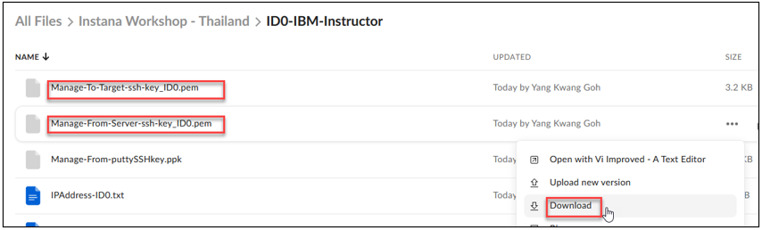
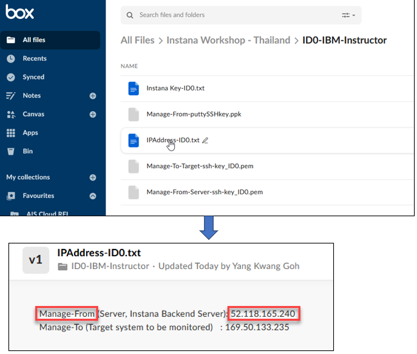
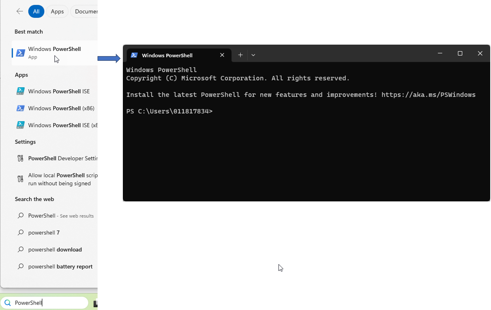
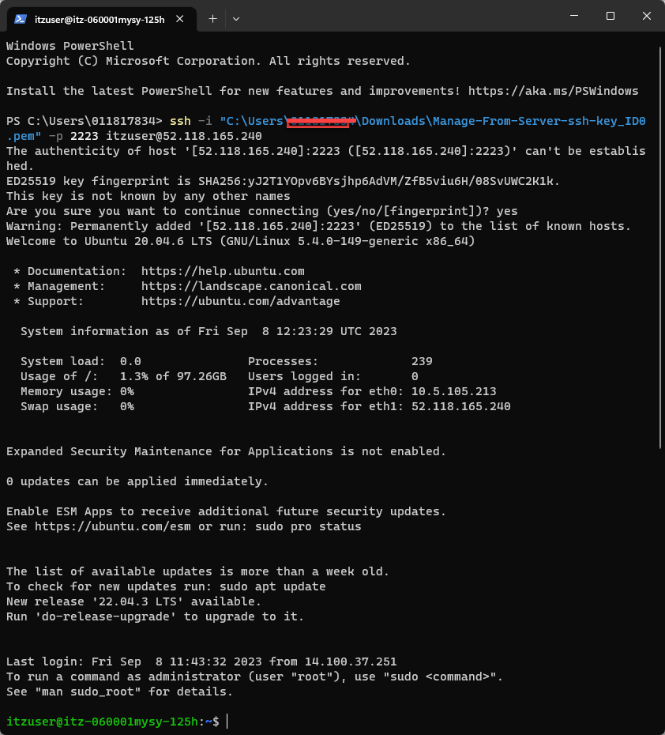

# Access VM using Window PowerShell with ssh key


1. Download the ssh keys from the Box into your local Download folder.

<picture>
  
</picture>

2. Check IP Address for the "Manage-From" host.

<picture>
  
</picture>

3. Launch PowerShell

<picture>
  
</picture>

4. Enter ssh command as follow:

```sh
ssh -i "C:\Users\<username>\Downloads\Manage-From-Server-ssh-key_ID0.pem" -p 2223 itzuser@52.118.165.240
```
<picture>
  
</picture>

