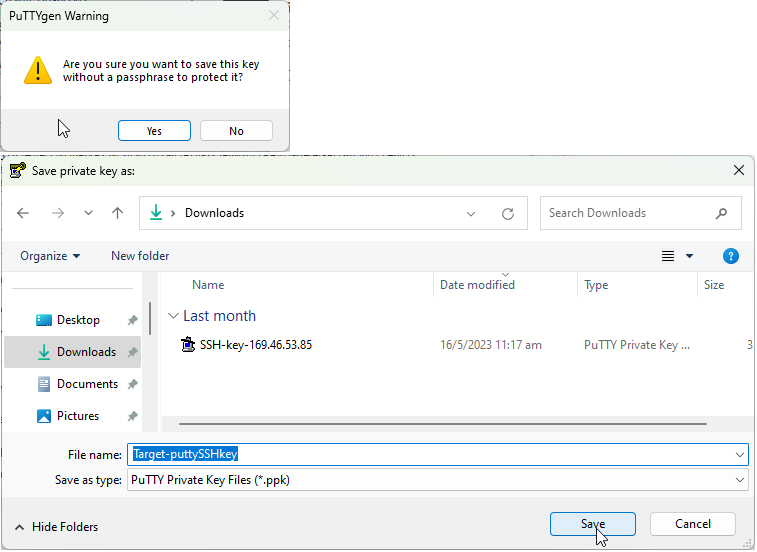

# Access VM using putty with ssh key

1. Launch PuTTYgen
2. Select "Import Key" from the "Conversions" menu.

<picture>
  
</picture>

3. Select the "SSH key" ("Target-ssh-key.pem" or "Server-ssh-key.pem") and click open

<picture>
  
</picture>

4.Click "Save private key". Can use any name e.g "Target-puttySSHkey". 
> note: Leave the passphrase empty.If prompted, click "yes".

<picture>
  
</picture>
 
<picture>
  
</picture>

5. Close PuTTYgen

6. Launch PuTTY

7. Enter IP Address of your "Target" host and use port 2223.
   Eneter "target-\<YOUR Target IP Address\>" in "Saved Sessions"

<picture>
  
</picture>

8.Now, need to set the converted SSH key from PuTTYgen.
  On the left panel, navigate to Connection-\>SSH-\>Auth-\>Credentials

<picture>
  
</picture>

9. Browse and select your save private key "Target-puttySSHkey".
   Same for both "Private key" and "Certificate" enteries.

<picture>
  
</picture>

10. Navigate to "Session" on the left panel and click "Save"

<picture>
  
</picture>

11. Click "Open", a terminal will be open. Enter "itzuser" on login as.

<picture>
  
</picture>

12. Repeat steps 1-11 for another VM, the Instana Server, using "Server-ssh-key.pem".

