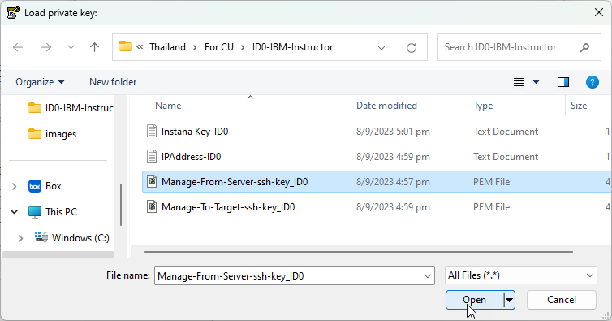
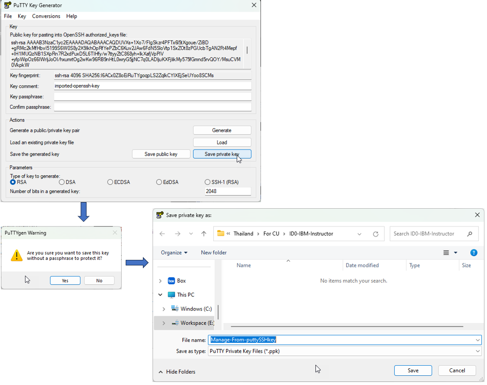
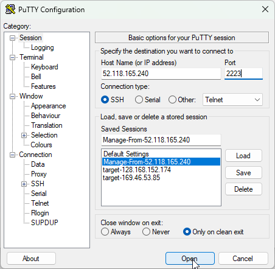
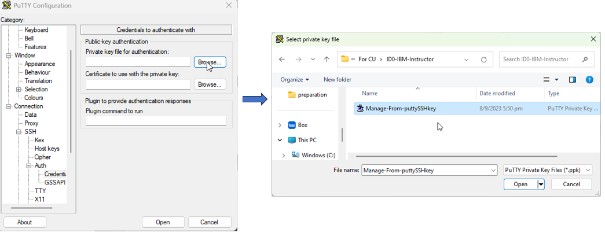
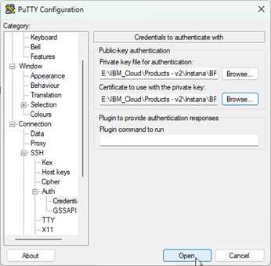

# Access VM using putty with ssh key

To download putty, [here](https://www.putty.org/)

1. Download the ssh keys from the Box into your local folder of your choice.

<picture>
  
</picture>

2. Launch PuTTYgen
3. Select "Import Key" from the "Conversions" menu.

<picture>
  
</picture>

4. Select the "SSH key" ("Manage-From-Server-ssh-key_ID0" or "Manage-To-Target-ssh-key_ID0.pem") and click open

<picture>
  
</picture>

5.Click "Save private key". Can use any name e.g "Manage-From-puttySSHkey". 
> note: Leave the passphrase empty.If prompted, click "yes".

<picture>
  
</picture>
 
6. Close PuTTYgen

7. Launch PuTTY

8. Enter IP Address of your "Target" host and use port 2223.
   Eneter "target-\<YOUR Target IP Address\>" in "Saved Sessions"

<picture>
  
</picture>

9.Now, need to set the converted SSH key from PuTTYgen.
  On the left panel, navigate to Connection-\>SSH-\>Auth-\>Credentials

<picture>
  
</picture>

10. Browse and select your save private key "Target-puttySSHkey".
   Same for both "Private key" and "Certificate" enteries.

<picture>
  
</picture>

11. Navigate to "Session" on the left panel and click "Save"

<picture>
  
</picture>

12. Click "Open", a terminal will be open. Enter "itzuser" on login as.

<picture>
  
</picture>

13. Repeat steps 1-11 for another VM, the Instana Server, using "Server-ssh-key.pem".

