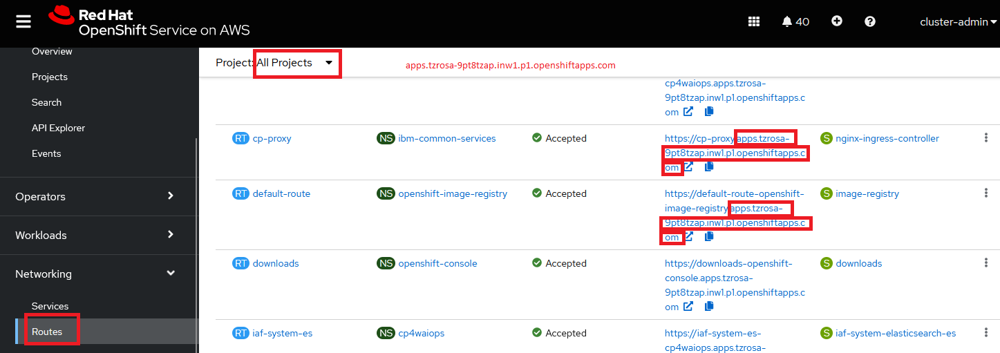
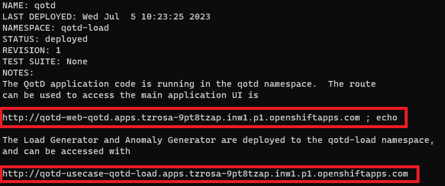

The git url for qotd helm deployment is [here](https://gitlab.com/quote-of-the-day/quote-of-the-day/-/blob/master/helm_deployment.md)

## To get familiar with helm installation command syntax

To jump to the installation, [here](https://github.com/yangkwang/Instana_workshop/blob/main/qotd/qotd-openshift.md#openshift-3x4x-installation)

The basic command to install a helm chart is:

`helm install [RELEASE NAME] [REPO NAME/CHART NAME] [flags]`

Where in our case the `[REPO NAME/CHART NAME]` value is `qotd/qotd`.  If you choose a release name like `qotd` to be the instance name then the install command will look a little redundant, but is nonetheless correct. Here is an example on how such a command would look:

```shell
helm install qotd qotd/qotd \
...
```

Given below are the details for the most frequenetly used flags that are used while installing a helm chart. 

### Instana 

QotD has been instrumented for Instana.  If you expect Instana will be collecting information, then you should enable the integration with the following flag:

```bash
helm install qotd qotd/qotd \
    --set host=apps.mycluster.com \
    --set enableInstana=true

```

If the Instana server is configured for QotD as a Web Application, you must pass in the reporting URL, JavaScript URL, and the Instana key as provided by the Web Application definition in the Instana server.

```bash
helm install qotd qotd/qotd \
    --set host=apps.mycluster.com \
    --set instanaReportingUrl=http://instana-server.example.com:2999/ \
    --set instanaEnumMinJsUrl=http://instana-server.example.com:2999/eum.min.js \
    --set instanaKey=8nGj0E7iT6C2ZmVkP7UfgQ \
    --set enableInstana=true

```

### Namespaces/projects

The default projects for the application and load/anomaly generators are `qotd` and `qotd-load` respectively.  These can be changed with the `appNamespace` and `loadNamespace` helm variables (notice the release name is `qotd2` this is just in case you still have a release called `qotd` created with the above examples).  For example:

```bash
helm install qotd2 qotd/qotd \
    --set host=apps.mycluster.com \
    --set appNamespace=qotd2 \
    --set loadNamespace=load2 

```

### Branding

You can add a "branding string" to the user interfaces with the `branding` helm variable.

```bash
helm install qotd qotd/qotd \
    --set host=apps.mycluster.com \
    --set branding="QotD - A demo app for the literate"

```

### Auto shutoff

By default an anomaly will shut itself off (that means, stopping all induced anomalies) after 1 hr.  This was added to prevent the anomaly running for long periods of time, when users forget to clear it.  If you absolutely need the anomaly to persist 1 hr., then you can helm property `autoShutoff` to `false`.

```bash
helm install qotd qotd/qotd \
    --set autoShutoff=false

```

### Independent loggers

The flag `setDefaultLoggers` when set to true will define two indepenent loggers, one with the ratings service and the other with the PDF service.

The format of the logger in the rating service is:
```txt
Heartbeat status: {{STATUS}}
```
Where the value of `{{STATUS}}` is either [ `OK` | `SLOW` ] with the value `OK` occuring 80% of the time, every 30 seconds.

The format of the PDF service logger is 

```txt
incident error code: E{{v1}} epid={{v2}} dsteuid={{v3}} dstepid={{v4}} vd={{user}} type={{type}} subtype={{subtype}}

```

Where the fields `v1` through `v4` are randomly generated 4 digit integers, the `type` field is one of [ `access` | `update` | `weight` ], and `subtype` is one of [ `read` | `write` | `delete` ].

If you want to have other default loggers, or change the default "factory settings" in any way, then all you have to do is modify this configmap after the chart is installed with the (`setDefaultLoggers` option set to true) and restart all the pods.  They will pick up this new default configuration and start generating logs defined within them.

## Helm chart installation for Openshift, ROKS, and Kubernetes Nodeport

Add the QotD chart to the local repository. By default the latest version of the chart is used.

```sh
helm repo add qotd https://gitlab.com/api/v4/projects/26143345/packages/helm/stable

helm repo update
```

### OpenShift 3.x/4.x installation 

Before installing with Helm, you must create the namespaces and set the security contexts to allow root access (a current requirement for the database and Selenium based load generator).  The default namespaces for the chart are `qotd` and `qotd-load`.

```bash
oc new-project qotd
oc adm policy add-scc-to-user anyuid -z default

oc new-project qotd-load
oc adm policy add-scc-to-user anyuid -z default

```

For OpenShift deployments, the web and anomaly generator services have exposed routes. Because of this, you should obtain the FQDN for your OpenShift cluster before installing the helm chart. The FQDN value is the base URL for your Red Hat OpenShift cluster, for example, `itzroks-310000ux7w-wi66b0-6ccd7f378ae819553d37d5f2ee142bd6-0000.us-south.containers.appdomain.cloud` or `apps.mycluster.com`. Please note that the FQDN value for your cluster may vary depending on the actual OpenShift platform you are using (e.g. ROKS, Fyre, etc.).

To get the base URL for your Red Hat OpenShift cluster.

<picture>
  
</picture>

Example

```bash
helm install qotd qotd/qotd \
--set host=apps.tzrosa-9pt8tzap.inw1.p1.openshiftapps.com \
--set instanaReportingUrl=https://162.133.77.88.nip.io:446/eum/ \
--set instanaEnumMinJsUrl=https://162.133.77.88.nip.io:446/eum/eum.min.js \
--set instanaKey=1X2-DHuzQACS16gp1bKIrw \
--set enableInstana=true
```


```bash
helm install qotd-chart qotd/qotd \
    --set enableInstana=true \
    --set host=apps.mycluster.com 

```

Once successfully deployed, both qotd and qotd-load are created.

<picture>
  
</picture>

**However on ROKS**, in order to get the Instana collector to connect to the agent properly you need to include an additional parameter to the helm install command to set `roksCluster` to `true`.

```bash
helm install qotd-chart qotd/qotd \
    --set host=itzroks-310000ux7w-wi66b0-6ccd7f378ae819553d37d5f2ee142bd6-0000.us-south.containers.appdomain.cloud \
    --set roksCluster=true

```

### Kubernetes NodePort installation

Before installing with Helm, you must create the namespaces and set the security contexts to allow root access (a current requirement for the database and Selenium based load generator).  The default namespaces for the chart are `qotd` and `qotd-load`.

```bash
kubectl create namespace qotd
kubectl create namespace qotd-load

# optionally set the default namespace to qotd
kubectl config set-context --current --namespace=qotd

```

For Generic Kubernetes deployments the three UI services; main app, load and anomaly generators must use a NodePort service.  The chart makes some assumptions on the allocated port numbers, that should be verified after deployment.

To install first use `kubectl` to log into the kubernetes cluster.  The `-n` argument is the namespace on the target cluster to begin the install with.

```bash
helm install qotd qotd/qotd  --set useNodePort=true -n qotd 
 
```

QotD has been instrumented for Instana.  If you expect Instana will be collecting information, then you should enable the integration with the following flag:

```bash
helm install qotd qotd/qotd \
    -n qotd \
    --set useNodePort=true \
    --set enableInstana=true

```

If the Instana server is configured for QotD as a Web Application, you must pass in the reporting URL, JavaScript URL, and the Instana key as provided by the Web Application definition in the Instana server.

```bash
helm install qotd qotd/qotd \
    -n qotd \
    --set useNodePort=true \
    --set instanaReportingUrl=http://instana-server.example.com:2999/ \
    --set instanaEnumMinJsUrl=http://instana-server.example.com:2999/eum.min.js \
    --set instanaKey=8nGj0E7iT6C2ZmVkP7UfgQ \
    --set enableInstana=true

```

The default projects for the application and load/anomaly generators are `qotd` and `qotd-load` respectively.  These can be changes with the `appNamespace` and `loadNamespace` helm variables.  For example:

```bash
helm install qotd qotd/qotd \
    -n qotd2 \
    --set useNodePort=true \
    --set appNamespace=qotd2 \
    --set loadNamespace=load2 

```


