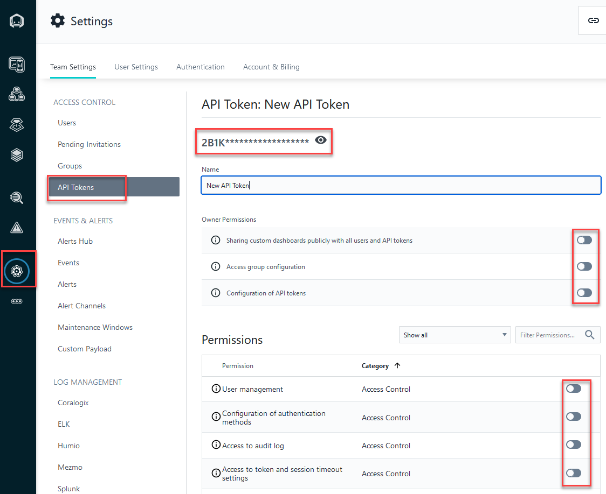
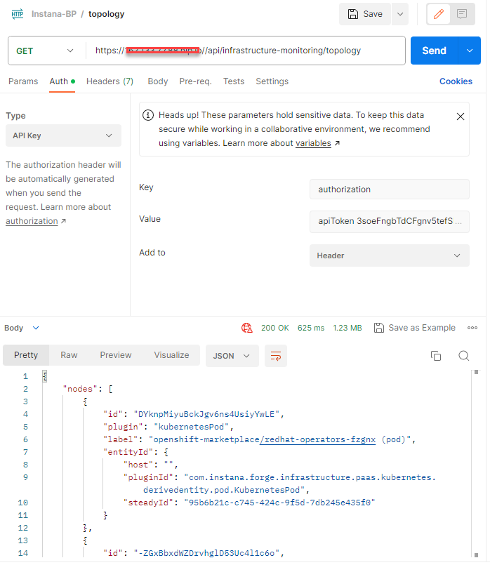

The document on Instana rest api is [here](https://instana.github.io/openapi/)

# Create the API token

<picture>
  
</picture>


# Sample curl command

```sh
curl -k --request GET --url "https://<Instana server>//api/infrastructure-monitoring/topology" --header 'authorization: apiToken 3soeFngbTdCFgnv5tefSFQ'
```


# Sample Postman

<picture>
  
</picture>


